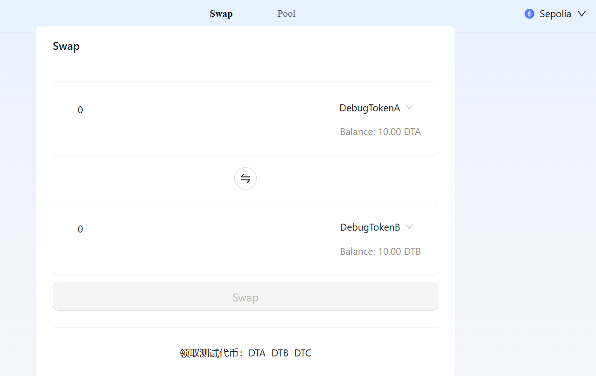

# Miniswap

## 设计思路

自顶向下的五个合约(基于 WTF 简化思路)：
1. PoolManager.sol: 顶层合约，对应 Pool 页面，负责 Pool 的创建和管理(这个能力继承自 Factory)。还给 DApp 提供获取所有交易池信息的接口，这样的接口可以通过服务端来提供，它并不是必须的。
2. PositionManager.sol: 顶层合约，对应 Position 页面，负责 LP 头寸和流动性的管理；
3. SwapRouter.sol: 顶层合约，对应 Swap 页面，负责预估价格和交易；用户也可以直接操作 pool，但是每个 pair 对应多个 pool，使用 router 更加安全高效便利。在 Uniswap 中可以 **多跳交换**，此处为了简化暂时不支持，**后续支持**。本项目先实现选择不同的价格区间的交易池（选择对用户最优的价格，一个池子不够就部分成交后选下一个池子，还不满足用户要求的 amount 就只实现部分成交）。
4. Factory.sol: 底层合约，Pool 的工厂合约；由 PoolManager 继承, 不需要单独部署.
5. Pool.sol: 最底层合约，对应一个交易池，记录了当前价格、头寸、流动性等信息。由 PoolManager 管理, 不需要单独部署

## 数学原理
1. 关于项目中用到的数学计算, 以及原理剖析和代码测试, 请查看此仓库: [ethan: uniswap 底层数学计算解析](https://github.com/EthanWalker10/testForUniswap)

## UI 设计
对应三个顶层合约，UI 主要包含 3 个主要界面：
1. Swap 页面，用于交易代币

2. Pool 页面，用于查看当前已经有的交易池和创建交易池。可以通过点击 My Positions 查看跳转到 Positions 页面查看自己的头寸

1. Positions 页面，用于查看和移除 Liquidity

## 参考 uniswap v3 && 做的主要改动(此模块实时更新)
1. mint 方法中 ticklower 和 tickupper 的获取是不一样的; V3 是在 mint 时实时从 param 中获取, 本项目则是在部署 Pool 时就指定了; 
2. 这里对每个用户的 Position 管理, 是通过维护一个 mapping(address => Position), 而不是通过为用户铸造 LP tokens
3. 在 Uniswap V3 中，一个池子本身没有价格上下限，而是池子中的每个头寸都有自己的上下限。所以在交易的时候需要去循环在不同的头寸中移动来找到合适的头寸来交易。而在此实现中，限制了池子的价格上下限，池子中的每个头寸都是同样的价格范围，所以不需要通过一个 while 在不同的头寸中移动交易，而是直接一个计算即可。
4. 负数代表 pool 需要转出的

